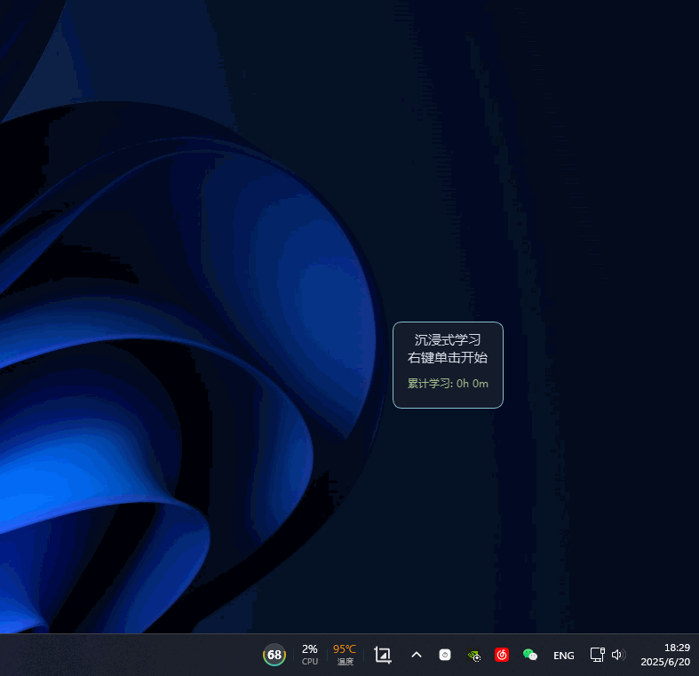

# MyTimeLogger (沉浸式学习记录器)

## 源起与理念

+ 本项目由github项目 https://github.com/Yogioo/StudyTimer 改进而来，感谢原作者
+ 有兴趣的同学可以自由尝试，欢迎提各种issue
+ 本项目和原项目的创作灵感完全来自于 Bilibili UP主 **择恩** 的视频分享。
  + **核心理念来源**: [为什么我能每天学习10小时 - 择恩](https://www.bilibili.com/video/BV1naLozQEBq/?spm_id_from=333.1391.0.0&vd_source=ba468568caebc92479698e83c28be8b0)	



一款专为对抗“计时器焦虑”而设计的桌面学习伴侣。它通过随机学习时长与自动长短休息机制，帮助你进入心流状态，让每一次专注都充满未知感和成就感。

## 核心特性

*   🎲 **随机周期**: 在设定的范围内随机生成学习时长（例如 3-9 分钟），打破固定周期的枯燥感，更符合真实心流波动。
*   ☕️ **智能休息**: 自动在短休息和长休息之间切换。当累计专注时间达到预设的大专注目标（如 90 分钟）时，强制进入长休息。
*   🏅 **成就反馈**: 完成一个完整的大专注目标后播放 `victory.mp3` 胜利音效，并弹出输入框记录本次成就。
*   📊 **精美统计**: 采用 SQLite 数据库持久化存储所有专注数据。支持在托盘菜单一键生成卡片式 HTML 统计报表，直观查看历史记录。
*   🖱️ **鼠标穿透**: 支持在“锁定”状态下实现背景透明及鼠标穿透，如同悬浮在显示器上的物理挂件，不遮挡任何工作区。
*   ⌨️ **全局热键**: 深度整合 `pynput`，支持自定义全局快捷键（开始、暂停、重置），无需切换窗口即可掌控全局。
*   📝 **记录复盘**: 暂停时需输入暂停原因，专注结束时可记录工作总结，通过数据回溯发现自己的“专注盲区”。
*   🎨 **高度定制**: 通过 `config.json` 即可自由修改时间参数、音效文件、热键绑定及管理员密码。

## 快速开始

1.  **下载**: 获取最新的 `MyTimeLogger.exe`（单文件版本）。
2.  **运行**: 直接双击即可启动。程序会在同级目录自动创建配置文件 `config.json` 和数据库 `study_log.db`。
3.  **运行环境**: 若从源码运行，需 `Python 3.8+` 环境并安装 `requirements.txt` 中的依赖。

## 使用指南

#### 常用交互
*   **锁定 / 解锁**: **双击窗口** 即可完成切换。锁定后窗口支持鼠标穿透（透明点击）。
*   **移动与缩放**: 在“解锁”状态下，点击窗口任意位置拖动；使用右下角的 QSizeGrip 手柄调整大小。
*   **托盘交互**: 右键点击右下角系统托盘图标，可以快速打开“统计”页面或进入“配置管理”。
*   **提前结束休息**: 如果在长休息期间感到精力已恢复，可以右键菜单选择“结束休息”立即重回专注。

#### 全局快捷键 (默认)
| 操作 | 快捷键 | 功能说明 |
| :--- | :--- | :--- |
| **开始** | `Alt` + `Z` | 启动计时器 |
| **暂停 / 恢复** | `Alt` + `C` | 暂停当前计时，会触发原因输入弹窗；从暂停状态恢复计时 |
| **重置轮次** | `Ctrl` + `Alt` + `R` | 重置当前所有进度，准备开始新一轮 |

## 配置文件说明 (`config.json`)

| 键名 | 含义 |
| :--- | :--- |
| `study_time_min/max` | 随机专注时长的下限与上限 (秒) |
| `short_break_duration` | 每轮之间短休息的时长 (秒) |
| `long_break_threshold` | 触发大专注长休息所需的累计时长 (秒) |
| `reset_password` | 执行数据库清理时的管理密码 (默认: 111) |
| `hotkeys` | 这里的组合键需严格遵循 pynput 规范字符串 |

## 项目结构

```text
MyTimeLogger/
├── my_time_logger.py        # 主程序逻辑 (PyQt6 + Pygame) v0.98
├── my_time_logger.spec      # PyInstaller 打包配置文件
├── study_music/             # 音频资源目录 (包含各种提醒音效)
├── document/                # 文档与资源
├── statistics.html          # 动态生成的卡片式统计报表
├── study_log.db             # SQLite 数据库文件 (存储所有专注记录)
├── requirements.txt         # 项目依赖清单
├── clear.bat                # 构建缓存清理脚本
└── clear_then_build.bat     # 一键清理并构建 exe 脚本
```

## 面向开发者

#### 运行源码
```bash
pip install -r requirements.txt
python my_time_logger.py
```

#### 构建打包 (Windows)
项目内置了便捷的打包脚本，依赖 `PyInstaller`:
- `clear.bat`: 清理 `dist` 和 `build` 文件夹。
- `clear_then_build.bat`: 清理并重新打包成单文件可执行程序。

## 许可 (License)
本项目采用 [MIT License](./LICENSE)。

## 致谢
*   [Yogioo/StudyTimer](https://github.com/Yogioo/StudyTimer): 本项目始于对该仓库的重构与功能增强。
*   Bilibili UP主 **择恩**: 感谢分享“随机计时器”的绝佳理念。