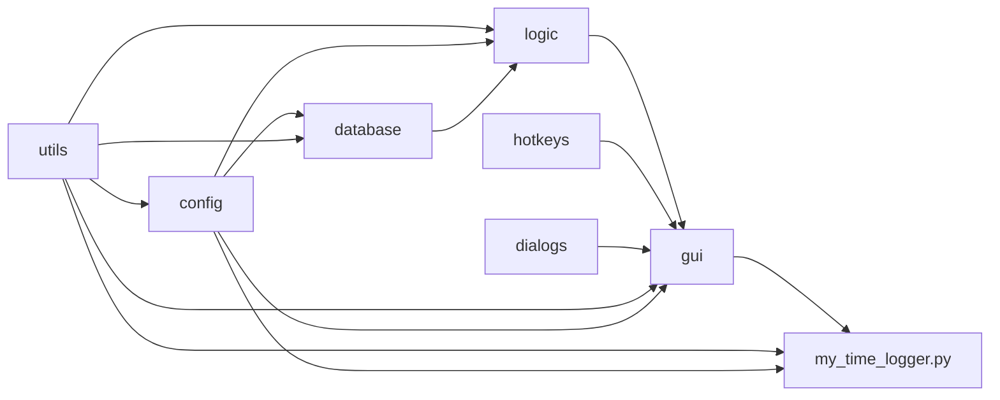
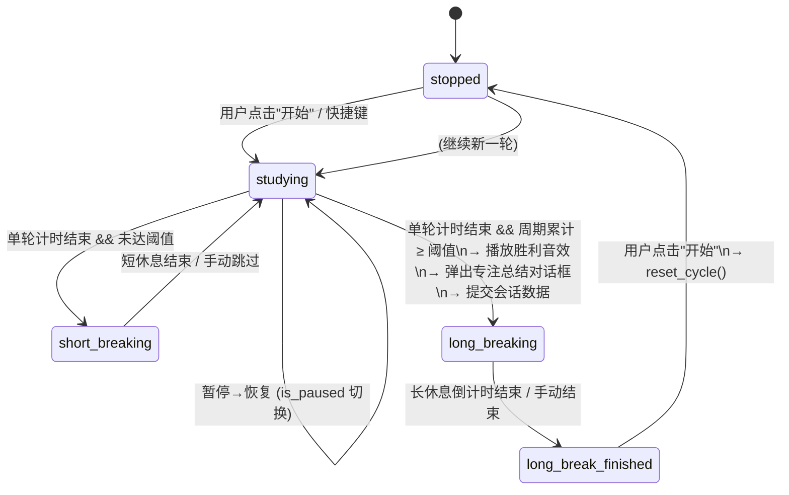
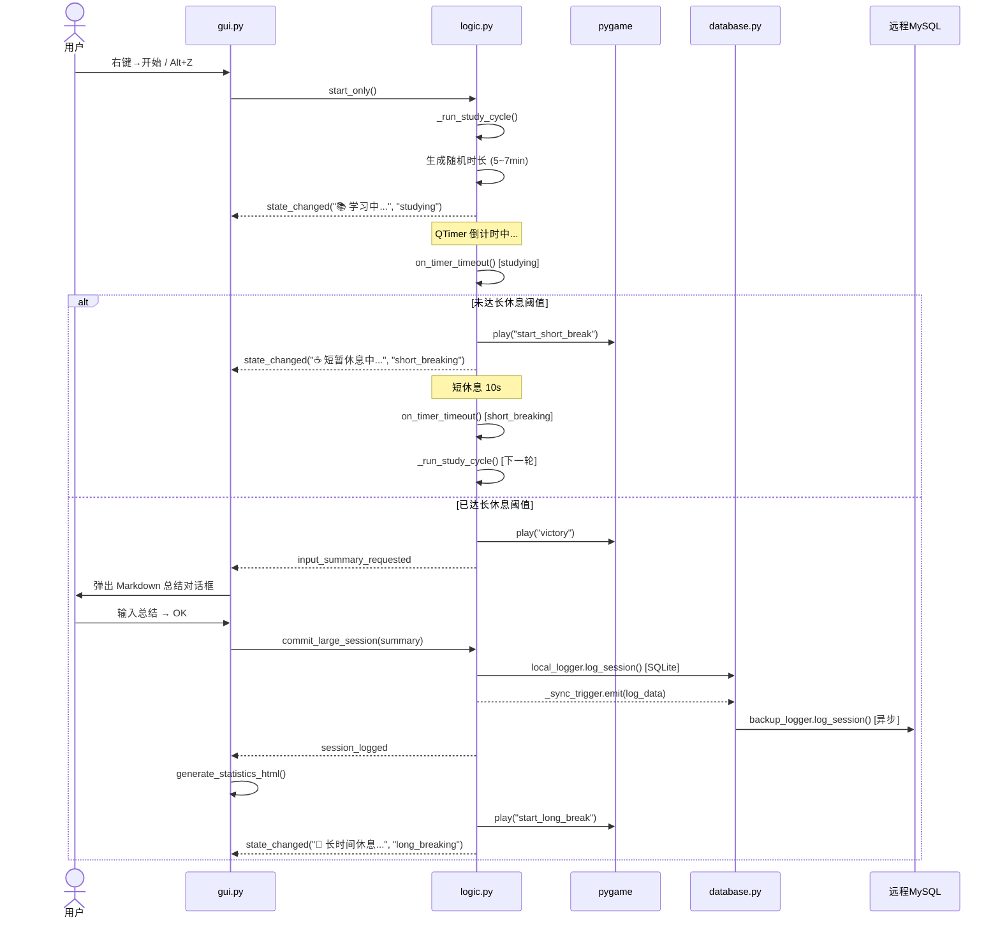
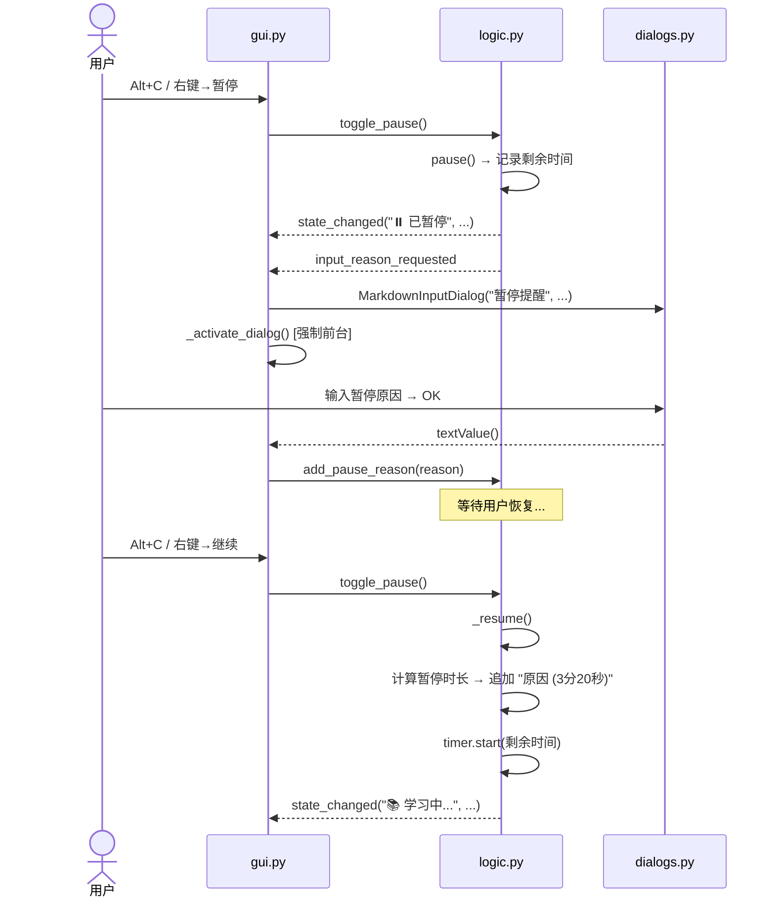
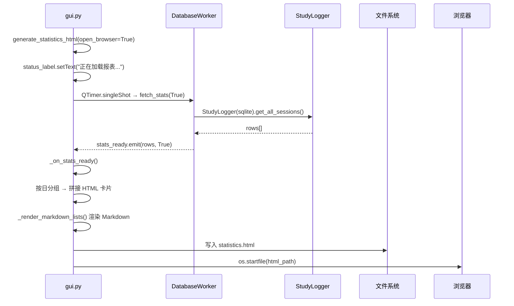

# MyTimeLogger 详细设计文档

> **版本**: v0.99  
> **更新时间**: 2026-04-17  
> **技术栈**: Python 3.14 · PyQt6 · pygame-ce · pynput · SQLite / MySQL

---

## 目录

1. [系统概述](#1-系统概述)
2. [系统架构](#2-系统架构)
3. [目录结构与文件清单](#3-目录结构与文件清单)
4. [模块详细设计](#4-模块详细设计)
5. [数据库设计](#5-数据库设计)
6. [配置文件设计](#6-配置文件设计)
7. [状态机设计](#7-状态机设计)
8. [信号通信机制](#8-信号通信机制)
9. [关键交互流程](#9-关键交互流程)
10. [线程模型](#10-线程模型)
11. [UI 设计](#11-ui-设计)
12. [打包部署](#12-打包部署)
13. [依赖清单](#13-依赖清单)

---

## 1. 系统概述

### 1.1 产品定位

MyTimeLogger 是一款桌面端**沉浸式学习计时器**，核心理念是「随机打断 + 强制休息」。系统在用户学习时以**随机间隔**触发短暂休息（micro-break），累计达到阈值后强制进入长休息，从而实现科学的番茄钟变体节奏。

### 1.2 核心功能矩阵

| 功能域 | 功能点 | 说明 |
|--------|--------|------|
| **计时** | 随机间隔学习轮次 | 每轮时长在 `[study_time_min, study_time_max]` 范围内随机 |
| **计时** | 短休息 / 长休息 | 短休息自动跳过，长休息倒计时显示，均可手动结束 |
| **计时** | 暂停 / 恢复 | 暂停时记录原因（Markdown）、暂停时长 |
| **记录** | 大专注会话 | 每个长休息周期视为一个"大专注"，记录起止时间、净时长、暂停明细、专注总结 |
| **记录** | 双数据库存储 | 本地 SQLite（主存储，毫秒级）+ 远程 MySQL（异步镜像备份） |
| **记录** | HTML 统计报表 | 本地生成卡片式统计页面，按日分组展示，支持暂停原因标签和 Markdown 总结渲染 |
| **交互** | 全局快捷键 | 基于 pynput，脱焦场景可操控开始/暂停/重置 |
| **交互** | 悬浮窗 | 无边框、半透明、可拖拽、支持鼠标穿透锁定 |
| **交互** | 双布局模式 | 标准模式 (220×140) 与迷你模式 (280×40) 一键切换 |
| **交互** | 系统托盘 | 右键菜单与悬浮窗右键菜单共享，支持显隐切换 |
| **功能** | TickTick 日清单同步 | 事件驱动同步（启动/操作/刷新），支持标识分类映射 ID 缓存 |
| **功能** | 任务聚焦与插旗 | 支持右键菜单修改 TickTick 任务优先级，对齐原生旗帜视觉 |
| **音效** | 场景音效 | 学习开始、短休息、长休息开始/结束、达成目标各有独立音效 |

---

## 2. 系统架构

### 2.1 分层架构

系统采用三层架构（展示层 → 业务逻辑层 → 数据层），层间通过 **Qt 信号-槽机制** 解耦。

```
┌─────────────────────────────────────────────────────┐
│                   主入口 (my_time_logger.py)          │
│         QLockFile 单实例 · 依赖检查 · 日志初始化        │
└──────────────────────┬──────────────────────────────┘
                       │
┌──────────────────────▼──────────────────────────────┐
│               展示层 (Presentation)                   │
│  ┌──────────────────┐  ┌──────────────────────────┐  │
│  │  gui.py           │  │  dialogs.py              │  │
│  │  MyTimeLoggerGUI  │  │  MarkdownTextEdit        │  │
│  │  · 悬浮窗主体     │  │  MarkdownInputDialog     │  │
│  │  · 右键/托盘菜单  │  │  · 暂停原因输入          │  │
│  │  · 统计报表渲染   │  │  · 专注总结输入          │  │
│  │  · 倒计时显示     │  └──────────────────────────┘  │
│  └──────────────────┘                                 │
└──────────────────────┬──────────────────────────────┘
                       │ pyqtSignal
┌──────────────────────▼──────────────────────────────┐
│              业务逻辑层 (Business Logic)               │
│  ┌──────────────────┐  ┌──────────────────────────┐  │
│  │  logic.py         │  │  hotkeys.py              │  │
│  │  MyTimeLoggerLogic│  │  HotkeyManager           │  │
│  │  · 状态机引擎     │  │  · pynput GlobalHotKeys  │  │
│  │  · 计时器管理     │  │  · 信号桥接到 Logic      │  │
│  │  · 音频调度       │  └──────────────────────────┘  │
│  │  · 会话数据组装   │                                 │
│  └──────────────────┘                                 │
└──────────────────────┬──────────────────────────────┘
                       │ pyqtSignal / 直接调用
┌──────────────────────▼──────────────────────────────┐
│                数据层 (Data Access)                    │
│  ┌──────────────────┐  ┌──────────────────────────┐  │
│  │  database.py      │  │  config.py               │  │
│  │  StudyLogger      │  │  DEFAULT_CONFIG          │  │
│  │  · SQLite / MySQL │  │  load_or_create_config() │  │
│  │  DatabaseWorker   │  │  save_config()           │  │
│  │  · QThread 异步   │  └──────────────────────────┘  │
│  └──────────────────┘                                 │
│  ┌──────────────────┐                                 │
│  │  utils.py         │                                │
│  │  resource_path()  │                                │
│  │  setup_logging()  │                                │
│  └──────────────────┘                                 │
└─────────────────────────────────────────────────────┘
```

### 2.2 模块依赖关系

依赖链为**单向无环**，从底层到上层：



### 2.3 睡眠分析云端化架构 (v7.0)

睡眠分析链路新增“纯分析核心 + 云端 Buffer + PC 主动拉取”三段式结构：

| 模块 | 类型 | 职责 |
|------|------|------|
| `sleep_analyzer.py` | 纯 Python 核心 | 视觉 OCR、JSON 提取、字段归一化、数学校验、报告生成，无 PyQt 依赖 |
| `sleep_statistics.py::AIWorker` | 桌面适配层 | 在线程内调用 `SleepAnalyzer`，并把进度/结果转回 Qt 信号与本地 SSE |
| `cloud_sleep_store.py` | 云端 Buffer 数据层 | 使用 `cloud_sleep_jobs.db` 保存请求状态、结果、错误和同步确认 |
| `cloud_sleep_api.py` | FastAPI 服务 | 提供上传、状态查询、SSE、增量同步、ACK、最近记录和评价接口 |
| `cloud_sleep_client.py` | PC 同步客户端 | PC 启动后和定时主动拉取云端完成结果，写入本地 `huawei_sleep_data` |
| `cloud_runtime_config.py` | 容器运行时配置 | Docker 模式下从环境变量生成最小根配置和 time-management 技能配置 |

云端接口除 `/ping` 和首页外均要求 `X-Auth-Token`。云端 AI Key 和 Token 通过环境变量注入，避免写入 `config.json`。

新增配置：

```json
"cloud_sleep_sync": {
  "enabled": false,
  "base_url": "",
  "auth_token": "",
  "sync_interval_sec": 300,
  "last_sync_at": ""
}
```

同步冲突规则：
- 云端 `updated_at` 晚于本地时才覆盖指标和报告。
- 本地 `sleep_reflection` 非空而云端为空时保留本地评价。
- 同步成功后 PC 调用 `/ack_sync`，云端递增 `sync_count` 并记录 `acked_at`。

Docker 部署文件：
- `Dockerfile`：基于 `python:3.12-slim` 构建云端服务镜像。
- `docker-compose.yml`：一键启动 `sleep-cloud`，默认映射 `8000:8000`。
- `.env.example`：环境变量模板。
- `scratch/create_cloud_env_from_local.py`：从本机配置生成 `.env`，并自动生成 `SLEEP_AUTH_TOKEN`。
- `scratch/enable_local_cloud_sync.py`：将 PC 端同步配置指向本机 Docker 服务。

---

## 3. 目录结构与文件清单

```
MyTimeLogger/
├── my_time_logger.py      # 程序主入口 (77 行)
├── utils.py               # 工具函数：资源路径 + 日志 (93 行)
├── config.py              # 配置管理：默认值 + 加载/保存 (139 行)
├── database.py            # 数据持久化：StudyLogger + DatabaseWorker (294 行)
├── dialogs.py             # 对话框组件：Markdown 编辑器 (160 行)
├── logic.py               # 核心状态机：计时 + 音频 + 会话管理 (319 行)
├── hotkeys.py             # 全局快捷键管理 (79 行)
├── gui.py                 # 主窗口 GUI (896 行)
│
├── config.json            # 用户配置文件 (运行时生成/修改)
├── study_log.db           # SQLite 数据库文件 (运行时生成)
├── statistics.html        # 统计报表 (运行时生成)
├── requirements.txt       # Python 依赖声明
├── my_time_logger.spec    # PyInstaller 打包配置
│
├── study_music/           # 音效资源文件夹
│   ├── start_study.mp3          # 学习开始音效
│   ├── start_short_break.mp3    # 短休息开始音效
│   ├── start_long_break.mp3     # 长休息开始音效
│   ├── end_long_break.mp3       # 长休息结束音效
│   ├── victory.mp3              # 达成大专注目标音效
│   └── short_break.mp3          # (备用)
│
├── document/              # UI 资源文件夹
│   ├── icon.ico                 # 应用图标
│   ├── expand.svg / .png        # 迷你模式展开按钮图标
│   ├── shrink.svg / .png        # 标准模式收缩按钮图标
│   └── anim.gif                 # README 演示动画
│
├── log/                   # 日志目录 (运行时生成)
│   └── YYYY-MM-DD.log          # 按日轮转日志文件
│
├── build/                 # PyInstaller 构建临时目录
├── dist/                  # PyInstaller 输出目录
└── .git/                  # Git 版本控制
```

---

## 4. 模块详细设计

### 4.1 `utils.py` — 工具模块

| 函数 | 签名 | 说明 |
|------|------|------|
| `resource_path` | `(relative_path: str) → str` | 资源路径解析。区分**用户数据**（config.json, study_log.db 等 → exe 同级目录）和**内置资源**（音频/图标 → `sys._MEIPASS` 临时目录）。确保 PyInstaller 打包后数据能正确持久化 |
| `setup_logging` | `() → None` | 初始化全局日志。双通道输出（控制台 + 文件），文件按天轮转保留 30 天，日志目录为 `{程序目录}/log/` |

**设计要点**:
- `resource_path` 通过白名单 `user_data_files` + 后缀检测来分类资源类型
- `setup_logging` 使用 `TimedRotatingFileHandler`，设置 `when="midnight"` 实现自动轮转
- 两个函数都在模块导入阶段可用（无 Qt 依赖），因此可被所有模块引用

---

### 4.2 `config.py` — 配置模块

#### 常量

| 名称 | 类型 | 说明 |
|------|------|------|
| `DEFAULT_CONFIG` | `dict` | 全量默认配置，作为零配置启动和字段补全的基准 |

#### 函数

| 函数 | 签名 | 说明 |
|------|------|------|
| `load_or_create_config` | `() → dict` | 加载 `config.json`。文件不存在则创建默认配置；存在则读取并自动补全缺失字段 |
| `save_config` | `(config_data: dict) → None` | 将配置字典写入 `config.json`，UTF-8 编码，4 空格缩进 |

**配置兼容逻辑**:
1. **快捷键字段迁移**: `start_resume → start`, `pause → toggle_pause`（向后兼容旧版）
2. **字段补全**: 遍历 `DEFAULT_CONFIG`，缺失的顶层/嵌套字段自动补入
3. **MySQL 模板保护**: 当 `mysql_config` 下已有用户配置时，不再补充 `//` 前缀的默认模板项
4. **异常降级**: JSON 解析失败时弹窗提醒并回退到 `DEFAULT_CONFIG`

---

### 4.3 `database.py` — 数据持久化模块

#### 类: `StudyLogger`

底层数据库读写层，支持 SQLite 和 MySQL 双后端。

| 方法 | 说明 |
|------|------|
| `__init__(config)` | SQLite 模式立即初始化表结构 + JSON 迁移；MySQL 模式仅保存配置，延迟到 Worker 异步初始化 |
| `_get_connection()` | 获取数据库连接。MySQL 模式支持连接复用 (`ping(reconnect=True)`)；SQLite 每次新建连接 |
| `_initialize_db()` | 创建 `study_sessions` 表（`IF NOT EXISTS`，非破坏性），MySQL 使用 InnoDB + utf8mb4 |
| `_migrate_from_json()` | 检测旧版 `study_log.json`，将其数据逐条插入 SQLite 后将原文件重命名为 `.bak` |
| `log_session(...)` | 插入一条学习会话记录。自动适配 SQLite (`?`) 和 MySQL (`%s`) 的占位符差异 |
| `get_all_sessions()` | 查询全表数据，按 `start_time ASC` 排序，统一转为字符串列表返回 |

**MySQL 配置解析规则**: `config.json` 中 `mysql_config` 的键以 `//` 开头表示「已注释/未启用」，`_get_connection()` 中会 `lstrip("/")` 还原真实键名。

#### 类: `DatabaseWorker(QObject)`

挂载于 `QThread` 的异步工作者。

| 信号 | 参数 | 说明 |
|------|------|------|
| `logged` | `()` | 记录完成 |
| `stats_ready` | `(list, bool)` | 统计数据就绪 (数据行列表, 是否打开浏览器) |
| `error_occurred` | `(str,)` | 错误消息 |

| 槽方法 | 说明 |
|--------|------|
| `init_db()` | 检测 MySQL 配置有效性 → 调用 `backup_logger._initialize_db()` 建表 |
| `sync_to_backup(data_dict)` | 接收会话数据字典 → 通过 `backup_logger.log_session()` 写入远程 MySQL |
| `fetch_stats(open_browser)` | 强制从本地 SQLite 读取全量数据 → 发射 `stats_ready` 信号 |

---

### 4.4 `dialogs.py` — 对话框模块

#### 类: `MarkdownTextEdit(QTextEdit)`

| 行为 | 触发条件 | 实现 |
|------|----------|------|
| 无序列表 | 输入 `-`/`+`/`*` 后按空格 | 删除符号字符 → `cursor.createList(ListDisc)` |
| 有序列表 | 输入 `1.` 后按空格 | 删除 `1.` → `cursor.createList(ListDecimal)` |
| 快捷提交 | `Ctrl+Enter` | 向上查找父 `QDialog` → 调用 `accept()` |

#### 类: `MarkdownInputDialog(QDialog)`

| 属性 | 值 |
|------|-----|
| 最小尺寸 | 500 × 350 |
| 窗口层级 | `WindowStaysOnTopHint` |
| 主题 | Nord 暗色（#2E3440 背景, #ECEFF4 文字, #88C0D0 高亮） |
| 默认内容 | `+ ` (带列表符号) |
| 按钮布局 | Cancel 在左, OK 在右 |
| 导出格式 | `toMarkdown()` |

---

### 4.5 `logic.py` — 核心逻辑模块

#### 类: `MyTimeLoggerLogic(QObject)`

核心状态机，驱动整个学习计时流程。详见 [§7 状态机设计](#7-状态机设计)。

**关键属性**:

| 属性 | 类型 | 说明 |
|------|------|------|
| `current_state` | `str` | 当前状态（5 种状态之一） |
| `cycle_count` | `int` | 当前大专注中的微轮次计数 |
| `total_study_time` | `int` | 可持久化的累计学习秒数 |
| `current_cycle_study_time` | `int` | 当前大专注周期内的累计学习秒数 |
| `large_session_*` | 多种 | 大专注会话状态（起始时间、暂停次数/原因列表、净时长） |
| `current_session_*` | 多种 | 当前微轮次临时记录（起始时间、预设时长） |
| `is_paused` | `bool` | 是否处于暂停状态 |
| `timer` | `QTimer` | 单次触发计时器，驱动状态转换 |
| `local_logger` | `StudyLogger` | 本地 SQLite 直连实例 |
| `db_worker` | `DatabaseWorker` | 后台异步 Worker |

**关键方法**:

| 方法 | 说明 |
|------|------|
| `_run_study_cycle()` | 生成随机时长 → 设置计时器 → 进入 studying 状态 |
| `_run_short_break_cycle()` | 进入短休息 → 自动计时结束后回到学习 |
| `_run_long_break_cycle()` | 进入长休息 → 清零周期计时器 |
| `_finish_long_break()` | 结束长休息 → 系统通知 → 进入 long_break_finished |
| `on_timer_timeout()` | 统一超时回调 → 根据 current_state 分发到对应处理方法 |
| `commit_large_session(summary)` | 组装会话数据 → 同步写本地 → 异步推远程 → 发射 session_logged |
| `toggle_pause()` | 暂停/恢复切换 → 学习状态暂停时请求输入理由 |
| `_resume()` | 恢复计时 → 计算暂停时长 → 追加到暂停原因列表 |
| `_async_init_audio()` | 延迟 2s 初始化 pygame.mixer → 校验全部音效文件 |
| `_play_sound(key)` | 按 key 查找音效路径 → pygame.mixer.music 播放 |

---

### 4.6 `hotkeys.py` — 快捷键模块

#### 类: `HotkeyManager(QObject)`

| 信号 | 对应配置键 | 默认快捷键 |
|------|-----------|-----------|
| `start_triggered` | `hotkeys.start` | `<alt>+z` |
| `toggle_pause_triggered` | `hotkeys.toggle_pause` | `<alt>+c` |
| `reset_cycle_triggered` | `hotkeys.reset_cycle` | `<ctrl>+<alt>+r` |

**降级机制**: `pynput` 未安装时 `keyboard = None`，构造函数中 `self.listener = None`，`start()`/`stop()` 变为空操作。

**动态更换**: GUI 中修改快捷键后 → `stop()` → 更新 `hotkey_config` → `start()` 即可热生效。

---

### 4.7 `gui.py` — 图形界面模块

#### 类: `MyTimeLoggerGUI(QWidget)`

最大的模块（896 行），负责全部 UI 交互。按职责分区：

| 区域 | 核心方法 | 说明 |
|------|----------|------|
| **初始化** | `__init__` | 构建窗口/控件 → 连接信号 → 加载设置 |
| **通知与对话框** | `show_notification`, `prompt_for_pause_reason`, `prompt_for_session_summary` | 系统托盘通知 + Markdown 输入弹窗 |
| **对话框前台** | `_activate_dialog`, `_force_foreground` | Windows `AttachThreadInput` + `SetForegroundWindow` 组合拳，确保弹窗在全屏应用上方 |
| **布局管理** | `toggle_mini_mode`, `rebuild_layout` | 标准/迷你模式动态切换，销毁旧布局重建新布局 |
| **右键菜单** | `populate_context_menu` | 动态生成完整菜单树（状态信息、操作项、设置子菜单、透明度、重置） |
| **样式** | `update_stylesheet` | 根据透明度/锁定状态/布局模式动态生成 QSS |
| **系统托盘** | `create_tray_icon`, `_on_tray_activated` | 置顶模式下任何交互都确保窗口可见；非置顶模式下单击切换显隐 |
| **窗口交互** | `mousePressEvent` / `mouseMoveEvent` / `mouseDoubleClickEvent` | 无边框拖拽 + 双击锁定穿透 |
| **数据重置** | `confirm_and_reset_all` | 二次确认 → 密码鉴权 → 清数据库 → 重建表 → 刷新报表 |
| **统计报表** | `generate_statistics_html`, `_on_stats_ready`, `_render_markdown_lists` | 异步拉数据 → 按日分组 → 拼接 HTML 卡片 → 浏览器打开 |
| **关闭** | `closeEvent` | 清会话 → 保存设置 → 差异化写回 config → 停止 Logic/Hotkey/Tray |

---

### 4.8 `my_time_logger.py` — 主入口

启动流程按顺序执行：

```
1. setup_logging()           → 初始化日志系统
2. QApplication(sys.argv)    → 创建 Qt 应用实例
3. QLockFile.tryLock(100)    → 单实例检测（100ms 超时）
4. pynput 依赖检查           → 缺失则弹窗提醒
5. setQuitOnLastWindowClosed(False)  → 关闭窗口不退出（托盘驻留）
6. 检查 icon.ico 存在性      → 缺失则报错退出
7. load_or_create_config()   → 加载/创建配置
8. MyTimeLoggerGUI(config)   → 构建主窗口
9. window.show()             → 显示窗口
10. app.exec()               → 进入事件循环
```

---

## 5. 数据库设计

### 5.1 表结构: `study_sessions`

| 字段 | SQLite 类型 | MySQL 类型 | 说明 |
|------|-----------|-----------|------|
| `id` | `INTEGER PRIMARY KEY AUTOINCREMENT` | `INT AUTO_INCREMENT PRIMARY KEY` | 唯一标识 |
| `start_time` | `TIMESTAMP NOT NULL` | `DATETIME NOT NULL` | 大专注开始时间 |
| `end_time` | `TIMESTAMP NOT NULL` | `DATETIME NOT NULL` | 大专注结束时间 |
| `net_duration_minutes` | `REAL NOT NULL` | `DECIMAL(10,2) NOT NULL` | 净专注时长（分钟） |
| `date` | `TEXT NOT NULL` | `DATE NOT NULL` | 日期 (YYYY-MM-DD) |
| `day_of_week` | `TEXT` | `VARCHAR(20)` | 星期（英文，报表中转中文） |
| `pause_count` | `INTEGER DEFAULT 0` | `INT DEFAULT 0` | 暂停次数 |
| `pause_reasons` | `TEXT` | `TEXT` | 暂停原因明细（分号分隔，含时长） |
| `session_summary` | `TEXT` | `TEXT` | 专注总结（Markdown 格式） |

### 5.2 双数据库同步策略

```
                    主线程                          子线程 (QThread)
                      │                                │
  commit_large_session()                               │
          │                                            │
          ├─► local_logger.log_session()  ◄── 毫秒级写入 SQLite
          │           (同步，主线程)                     │
          │                                            │
          └─► _sync_trigger.emit(log_data) ──信号──► sync_to_backup()
                                                       │
                                               backup_logger.log_session()
                                                  (异步写入 MySQL)
```

**关键原则**: 本地 SQLite 写入在主线程同步完成（保证数据不丢），MySQL 同步在后台线程异步执行（不阻塞 UI）。

---

## 6. 配置文件设计

### 6.1 `config.json` 完整字段说明

```json
{
    "study_time_min": 300,          // 单轮学习最短时长（秒），默认 5 分钟
    "study_time_max": 420,          // 单轮学习最长时长（秒），默认 7 分钟
    "short_break_duration": 10,     // 短休息时长（秒）
    "long_break_threshold": 5400,   // 触发长休息的累计阈值（秒），默认 90 分钟
    "long_break_duration": 1200,    // 长休息时长（秒），默认 20 分钟
    "music_folder": "study_music",  // 音效文件夹相对路径
    "sound_files": {                // 各场景音效文件名映射
        "start_short_break": "start_short_break.mp3",
        "start_long_break": "start_long_break.mp3",
        "end_long_break": "end_long_break.mp3",
        "victory": "victory.mp3",
        "start_study": "start_study.mp3"
    },
    "total_study_time": 0,          // 持久化的累计学习时长（秒），程序退出时写入
    "reset_password": "111",        // 清空数据的鉴权密码
    "hotkeys": {                    // 全局快捷键（pynput 格式）
        "start": "<alt>+z",
        "toggle_pause": "<alt>+c",
        "reset_cycle": "<ctrl>+<alt>+r"
    },
    "db_type": "sqlite",            // 数据库类型: "sqlite" / "mysql"
    "mysql_config": {               // MySQL 连接配置
        "host": "127.0.0.1",       // 键名以 "//" 开头表示未启用
        "user": "root",
        "password": "your_password",
        "database": "mytimelogger",
        "port": 3306
    }
}
```

### 6.2 配置热更新范围

| 配置项 | 热更新 | 需重启 |
|--------|--------|--------|
| `study_time_min/max` | ✅ 下轮生效 | |
| `long_break_threshold` | ✅ 立即刷新倒计时 | |
| `hotkeys.*` | ✅ 立即重启监听器 | |
| `db_type` | | ✅ |
| `mysql_config.*` | | ✅ |
| `sound_files.*` | | ✅ |

---

## 7. 状态机设计

### 7.1 状态定义

| 状态 | 标识符 | 含义 |
|------|--------|------|
| 停止 | `stopped` | 初始状态 / 重置后 |
| 学习中 | `studying` | 正在计时学习 |
| 短休息 | `short_breaking` | 自动短暂休息（不可操作） |
| 长休息 | `long_breaking` | 达到阈值后的长休息 |
| 长休息结束 | `long_break_finished` | 等待用户手动开始下一个周期 |

### 7.2 状态转换图



### 7.3 暂停机制（横切状态）

暂停不是独立状态，而是通过 `is_paused` 标志横切于 `studying` / `short_breaking` / `long_breaking` 三个状态之上：

```
暂停时:
  1. 记录 timer.remainingTime() → time_remaining_on_pause
  2. timer.stop()
  3. is_paused = True
  4. current_pause_start_time = now()
  5. 发射 input_reason_requested (仅 studying 状态)

恢复时:
  1. timer.start(time_remaining_on_pause)
  2. is_paused = False
  3. 计算暂停时长 → 格式化 → 追加到 large_session_pause_reasons
  4. 恢复原状态文本显示
```

---

## 8. 信号通信机制

### 8.1 Logic → GUI 信号

| 信号 | 参数 | 触发时机 | GUI 响应 |
|------|------|----------|----------|
| `state_changed` | `(str, str)` | 每次状态转换 | 更新状态标签文本 + 启停倒计时 + 显隐结束休息按钮 |
| `time_updated` | `(int,)` | 累计时间变化 | 更新倒计时数字标签 |
| `notification_requested` | `(str, str)` | 长休息结束 | 系统托盘弹出通知 |
| `input_reason_requested` | `()` | 学习中暂停 | 弹出 MarkdownInputDialog 收集原因 |
| `input_summary_requested` | `()` | 达成大专注目标 | 弹出 MarkdownInputDialog 收集总结 |
| `session_logged` | `()` | 会话数据写入成功 | 刷新 HTML 统计报表 |

### 8.2 Logic → DatabaseWorker 信号

| 信号 | 参数 | 说明 |
|------|------|------|
| `_sync_trigger` | `(dict,)` | 携带会话数据字典，触发后台 MySQL 镜像写入 |

### 8.3 DatabaseWorker → GUI 信号

| 信号 | 参数 | 说明 |
|------|------|------|
| `stats_ready` | `(list, bool)` | 统计数据拉取完成，GUI 渲染 HTML |
| `error_occurred` | `(str,)` | 数据库错误，GUI 弹窗提示 |

### 8.4 HotkeyManager → Logic 信号

| 信号 | 连接目标 |
|------|----------|
| `start_triggered` | `logic.start_only` |
| `toggle_pause_triggered` | `logic.toggle_pause` |
| `reset_cycle_triggered` | `logic.reset_cycle` |

---

## 9. 关键交互流程

### 9.1 完整学习周期



### 9.2 暂停-恢复流程



### 9.3 统计报表生成



---

## 10. 线程模型

```
┌──────────────────────────────────────────┐
│              主线程 (GUI 线程)             │
│                                          │
│  QApplication 事件循环                    │
│  ├── MyTimeLoggerGUI (窗口/控件/绘制)     │
│  ├── MyTimeLoggerLogic (状态机/计时器)    │
│  ├── QTimer (倒计时/延迟)                 │
│  └── StudyLogger (本地 SQLite 同步读写)   │
│                                          │
└──────────────┬───────────────────────────┘
               │ pyqtSignal (线程安全)
┌──────────────▼───────────────────────────┐
│          QThread #1 (数据库线程)           │
│                                          │
│  DatabaseWorker                          │
│  ├── init_db()        远程 MySQL 初始化   │
│  ├── sync_to_backup() 远程 MySQL 写入     │
│  └── fetch_stats()    本地 SQLite 读取    │
│                                          │
└──────────────────────────────────────────┘
               
┌──────────────────────────────────────────┐
│       pynput 线程 (GlobalHotKeys)         │
│                                          │
│  HotkeyManager.listener                  │
│  └── 监听系统级热键 → emit Qt 信号        │
│                                          │
└──────────────────────────────────────────┘
```

**启动时序 (延迟加载)**:

| 延迟 | 操作 | 原因 |
|------|------|------|
| 0ms | 主窗口显示 | 极速启动 |
| 100ms | `db_worker.init_db()` | MySQL 连接可能阻塞 |
| 1000ms | `hotkey_manager.start()` | 降低启动峰值 CPU |
| 2000ms | `_async_init_audio()` | pygame 初始化较慢 |

---

## 11. UI 设计

### 11.1 配色方案 (Nord Theme)

| 用途 | 色值 | 说明 |
|------|------|------|
| 窗口背景 | `rgba(46, 52, 64, opacity)` | Nord Polar Night |
| 文字颜色 | `#D8DEE9` | Nord Snow Storm |
| 倒计时数字 | `#00CED1` | Dark Turquoise |
| 边框（未锁定） | `#88C0D0` | Nord Frost |
| 结束休息按钮 | `#BF616A` | Nord Aurora Red |
| 结束休息 hover | `#D08770` | Nord Aurora Orange |
| 菜单背景 | `#3B4252` | Nord Polar Night +1 |
| 菜单选中 | `#5E81AC` | Nord Frost Blue |

### 11.2 布局模式

**标准模式** (220 × 140):
```
┌──────────────────────┐
│                   [↗]│  ← 收缩按钮
│   📚 学习中...       │
│   (第 3 轮)          │
│                      │
│      85:30           │  ← 距长休息倒计时
│                      │
│   [⏹ 结束休息]       │  ← 仅长休息时可见
└──────────────────────┘
```

**迷你模式** (280 × 40):
```
┌──────────────────────────────┐
│ [↙] 📚 学习中...(第3轮) 85:30│
└──────────────────────────────┘
```

### 11.3 右键菜单结构

```
⏳ studying: 3m 45s          ← 当前状态（禁用项）
🎯 距长休息约: 82分           ← 进度信息（禁用项）
───────────────────
▶️ 开 始  (<alt>+z)
⏯️ 暂停 / 继续  (<alt>+c)
───────────────────
🔒 锁定 (鼠标穿透)
✅ 总在最前
⚙️ 设置 ►
    ├── 随机休息间隔 ►
    │     ├── ☐ 30秒 (测试)
    │     ├── ☐ 3~5 分钟
    │     ├── ☑ 5~7 分钟
    │     └── ☐ 6~9 分钟
    ├── 大专注时长 ►
    │     ├── ☐ 1 分钟 (测试)
    │     ├── ☐ 30 / 60 分钟
    │     ├── ☑ 90 分钟
    │     └── ☐ 120 分钟
    ├── 快捷键设置 ►
    │     ├── 设置开始键 (当前: <alt>+z)
    │     └── 设置暂停/恢复键 (当前: <alt>+c)
    └── 数据库设置 ►
          ├── ☑ SQLite (当前本地)
          └── ☐ MySQL (远程同步)
💧 透明度 ►
    ├── 100% ~ 1%
🔄 重置 ►
    ├── 重置当前轮次  (<ctrl>+<alt>+r)
    └── 🗑️ 清空所有记录
📂 打开日志文件夹
📊 查看统计 (网页版)
───────────────────
❌ 退 出
```

---

## 12. 打包部署

### 12.1 PyInstaller 配置要点

`my_time_logger.spec` 核心配置：

| 项目 | 值 | 说明 |
|------|-----|------|
| 入口脚本 | `my_time_logger.py` | 单入口文件 |
| datas | `study_music/`, `document/*` | 打包内嵌资源 |
| console | `False` | 无控制台窗口 |
| icon | `document/icon.ico` | exe 图标 |
| upx | `True` | 压缩可执行文件 |
| 输出模式 | 单文件 (`a.binaries + a.datas` in EXE) | 生成单个 exe |

### 12.2 模块化后的注意事项

拆分模块后，PyInstaller 会自动通过 import 分析找到所有 `.py` 模块。若出现打包遗漏，可在 `hiddenimports` 中手动添加：

```python
hiddenimports=['utils', 'config', 'database', 'dialogs', 'logic', 'hotkeys', 'gui']
```

---

## 13. 依赖清单

### 13.1 必选依赖

| 包名 | 版本要求 | 用途 |
|------|----------|------|
| `PyQt6` | ≥ 6.2.0 | GUI 框架、信号槽、系统托盘、QSettings |
| `pygame-ce` | ≥ 2.4.0 | 音频播放引擎 |
| `pynput` | ≥ 1.7.0 | 全局快捷键监听 |

### 13.2 可选依赖

| 包名 | 用途 | 缺失影响 |
|------|------|----------|
| `pymysql` | MySQL 远程同步 | 本地 SQLite 不受影响，远程同步功能禁用 |

### 13.3 标准库依赖

`os`, `sys`, `json`, `copy`, `re`, `time`, `random`, `sqlite3`, `logging`, `datetime`, `ctypes` (Windows)
### 11.4 窗口互斥规则
系统实施严格的窗口互斥策略（Window Exclusivity）：
- **Mini 条模式**：仅在后台计时或专注时保持最小占用。
- **大面板模式**：进行任务管理、查看统计或浏览清单时的主入口。
- **切换逻辑**：开启任一界面均会自动关闭另一个，通过 `switch_ui_mode` 统一管理，确保桌面清爽且无重叠。

### 11.5 日清单 UI (v3.5)
- **旗帜系统**：使用 FontAwesome 旗帜图标表示优先级（红/橙/蓝/灰）。
- **交互**：任务项右键菜单支持实时修改优先级并云端同步。
- **降噪**：移除了冗余的项目组标签，专注任务标题与分类。
